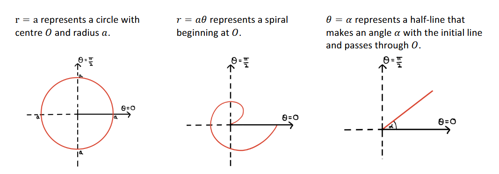

# Graphs

A collection of graphs for functions encountered in FM.

## Cartesian graphs


$\Large y = sinh \ x$

```functionplot
y = sinh(x)
```
---

$\Large y = cosh \ x$

```functionplot
y = cosh(x)
```
---

$\Large y = tanh \ x$

```functionplot
y = sinh(x)
```

## Polar graphs



Curves of the form
$$\Large
\begin{flalign}
r = a(p + q \ cos \ \theta)&&
\end{flalign}$$
where $p, q > 0$, will:
- be circular when $p = 0$
- be a cardioid when $p = q$
- have a 'dimple' when $1 \le \frac{p}{q} \lt 2$
- be 'egg-shaped' when $\frac{p}{q} \ge 2$


